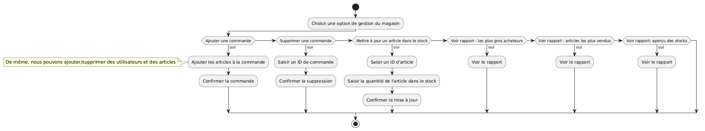
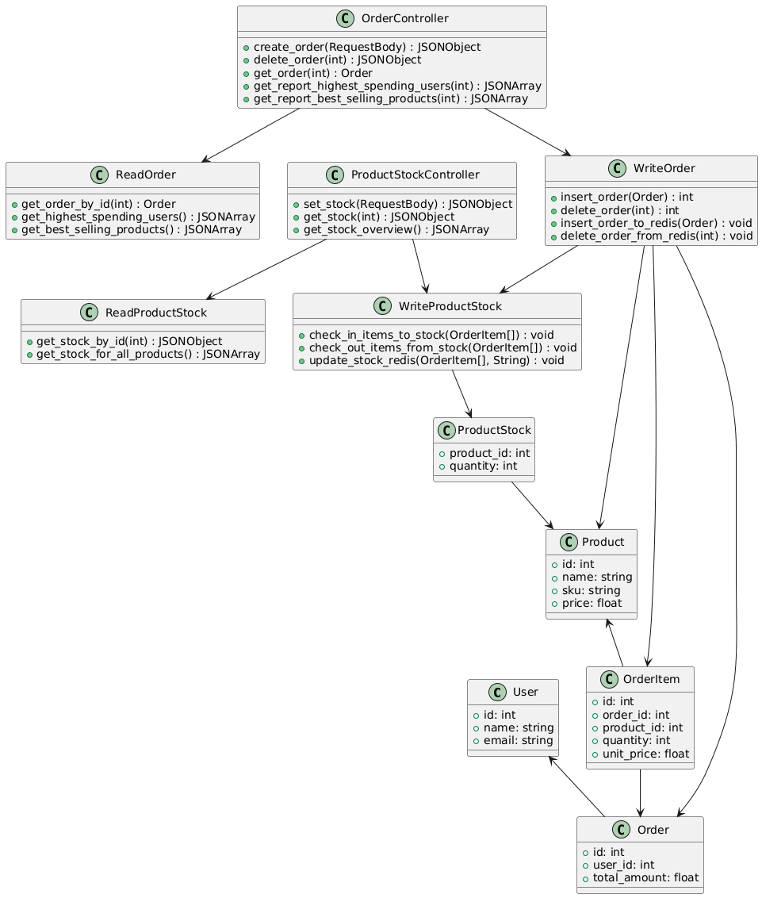
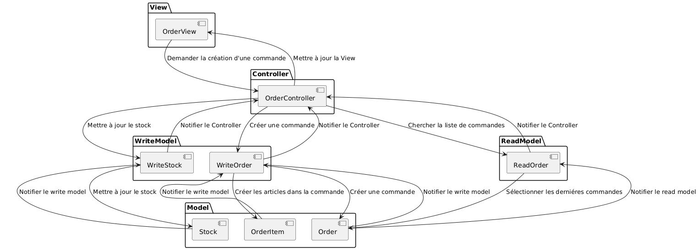
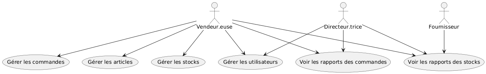
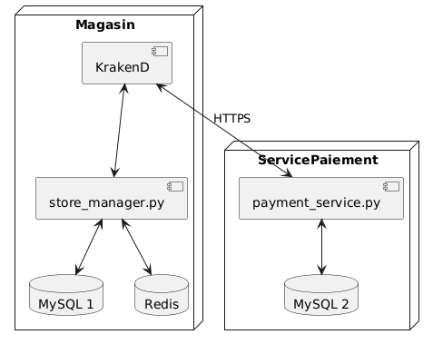

# Store Manager L05 - Documentation d'Architecture
Ce document, basé sur le modèle arc42, décrit une API REST de gestion de magasin avec capacités GraphQL pour le Labo 05, LOG430.

## 1. Introduction et Objectifs

### Panorama des exigences
L'application « Store Manager » est un système avec architecture microservices pour la gestion des utilisateurs, articles, commandes et stock dans un petit magasin. Elle sert de projet éducatif pour démontrer :
- L'implémentation d'une architecture API REST avec Flask
- L'intégration GraphQL pour des requêtes de données flexibles
- La fonctionnalité de gestion de stock avec cache Redis
- Le support multi-bases de données (MySQL et Redis)
- La comparaison des approches REST vs GraphQL
- L'optimisation des jointures SQL avec SQLAlchemy
- L'utilisation d'un API Gateway (KrakenD) pour le contrôle de timeout et rate limiting
- La transition vers une architecture microservices avec séparation des responsabilités

Nous ferons évoluer ce projet tout au long du cours LOG430, en intégrant de nouvelles fonctionnalités et en faisant évoluer notre architecture pour répondre aux nouvelles exigences.

### Objectifs qualité
| Priorité | Objectif qualité | Scénario |
|----------|------------------|----------|
| 1 | **Extensibilité** | Ajout facile de nouveaux endpoints API et clients grâce aux principes REST |
| 2 | **Flexibilité** | Support GraphQL permet aux clients de requêter exactement les données nécessaires |
| 3 | **Performance** | Cache Redis pour les données de stock et optimisation des jointures SQL |
| 4 | **Maintenabilité** | Séparation claire des responsabilités via les patrons MVC+CQRS et architecture microservices |
| 5 | **Fiabilité** | Rate limiting et timeout via KrakenD pour protéger les services backend |
| 6 | **Scalabilité** | Architecture microservices permet la mise à l'échelle indépendante des services |

### Parties prenantes (Stakeholders)
- **Développeuses et développeurs** : Apprendre/enseigner l'architecture API REST, GraphQL, microservices et les patrons de services web modernes
- **Employées et employés du magasin** : Utilisatrices et utilisateurs gérant les articles, commandes et stock via l'API
- **Clientes et clients du magasin** : Utilisatrices et utilisateurs finales servis par l'application (indirectement via les interactions avec les employé·es)
- **Fournisseurs** : Partenaires externes utilisant l'endpoint GraphQL pour vérifier l'état du stock et envoyer des données de réapprovisionnement

## 2. Contraintes d'architecture

| Contrainte | Description |
|------------|-------------|
| **Technologie** | Utilisation de Python 3, Flask, MySQL, Redis, KrakenD et Docker |
| **Déploiement** | Déploiement en conteneurs Docker avec communication réseau entre services |
| **Éducatif** | L'application doit clairement démontrer les principes REST vs GraphQL, la gestion de stock, les microservices et les bonnes pratiques API |
| **Conception API** | Doit suivre les principes RESTful et fournir une alternative GraphQL pour les requêtes flexibles |
| **API Gateway** | KrakenD comme point d'entrée unique pour tous les appels API avec contrôle de rate limiting et timeout |

## 3. Portée et contexte du système

### Contexte métier

Le système permet aux employé·es du magasin de :
- Gérer les comptes utilisateurs (employé·es et clientes)
- Gérer les articles vendus par le magasin
- Traiter les commandes des clientes
- Suivre et gérer les niveaux de stock des articles
- Générer des rapports de stock
- Permettre aux fournisseurs de consulter l'état du stock via GraphQL

### Contexte technique
- **Applications clientes** : Postman, applications fournisseurs, potentiels frontends web/mobiles
- **Couche API** : API REST Flask avec endpoint GraphQL
- **Couche base de données** : Backend MySQL avec cache Redis
- **API Gateway** : KrakenD pour le routage, rate limiting et timeout
- **Communication** : Requêtes HTTP/HTTPS entre clients, gateway et microservices

## 4. Stratégie de solution

| Problème | Approche de solution |
|----------|---------------------|
| **Standardisation API** | Principes REST avec méthodes HTTP et nommage de ressources appropriés |
| **Requêtes de données flexibles** | Endpoint GraphQL pour les clients nécessitant des champs de données spécifiques |
| **Gestion de stock** | Mises à jour automatiques du stock lors de création/suppression de commandes |
| **Performance** | Cache Redis pour les données de stock fréquemment accédées |
| **Support multi-BD** | MySQL pour l'écriture, Redis pour la lecture (rapports) |
| **Protection des services** | KrakenD API Gateway pour rate limiting et timeout |
| **Séparation des responsabilités** | Microservice dédié pour la gestion des commandes |
| **Scalabilité** | Architecture microservices permettant la mise à l'échelle indépendante |

## 5. Vue des blocs de construction

### Composants clés :
- **Contrôleurs API** : Gèrent les requêtes et réponses HTTP
- **Couche logique métier** : Traitement des commandes, gestion de stock
- **Models avec SQLAlchemy** : Abstraction de l'accès aux bases de données
- **Cache Redis** : Mise en cache des données de stock pour la performance
- **Schéma GraphQL** : Interface de requête flexible pour les fournisseurs

## 6. Vue d'exécution

### Scénarios clés :
1. **Traitement des commandes** : Client crée une commande → Stock automatiquement décrémenté
2. **Rapports de stock** : Génération de rapports de stock complets avec détails des articles
3. **Requêtes GraphQL** : Fournisseurs interrogent des champs de données de stock spécifiques
4. **Réapprovisionnement de stock** : Ajout de quantités de stock aux articles existants

## 7. Vue de déploiement

### Architecture conteneurs :
- **Conteneur API et bases de données** : Application Flask, MySQL, Redis.
- **Conteneur Payment Service** : API Flask dédiée aux [paiements](https://github.com/guteacher/log430-a25-labo5-payment)
- **KrakenD** : API Gateway
- **Réseau Docker** : Permet la communication entre conteneurs

## 8. Concepts transversaux
- **Principes REST** : Client-serveur, sans état, interface uniforme, système en couches
- **GraphQL** : Langage de requête pour la récupération flexible de données
- **Stratégie de cache** : Redis pour l'optimisation de la lecture des données de stock
- **Patrons de base de données** : Patron CQRS, ORM avec SQLAlchemy
- **Communication conteneurs** : Réseaux Docker pour la découverte de services
- **API Gateway Pattern** : Point d'entrée unique avec KrakenD
- **Microservices Pattern** : Séparation des responsabilités par domaine métier
- **Rate Limiting** : Protection contre les abus et surcharge
- **Circuit Breaker** : Timeout control pour éviter les blocages

## 9. Décisions d'architecture
Veuillez consulter le fichier `/docs/adr/adr001.md`.

## 10. Exigences qualité

### Extensibilité
- Ajout facile de nouveaux endpoints REST suivant les patrons établis
- Le schéma GraphQL peut être étendu pour de nouvelles exigences de données

### Flexibilité
- GraphQL permet aux clients de demander exactement les données dont ils ont besoin
- Support pour plusieurs backends de base de données (MySQL, Redis)
- Architecture microservices permet des changements indépendants

### Performance
- Cache Redis pour les données de stock réduit la charge de base de données
- Optimisation des jointures SQL pour les requêtes complexes

### Maintenabilité
- Séparation claire des préoccupations avec les patrons MVC+CQRS
- Conventions de nommage cohérentes à travers toutes les couches
- Conteneurisation Docker pour des environnements cohérents
- Microservices permettent des déploiements indépendants

### Fiabilité
- Rate limiting via KrakenD protège contre les abus
- Timeout control évite les blocages
- Isolation des pannes via l'architecture microservices

### Scalabilité
- Microservices peuvent être mis à l'échelle indépendamment
- KrakenD peut gérer la distribution de charge
- Base de données et cache séparés permettent une mise à l'échelle horizontale

## 11. Risques et dettes techniques
Voici un résumé des risques et des dettes techniques liés à l'application de gestion de magasin. S'agissant d'une application pédagogique conçue pour explorer les concepts architecturaux, nous assumons ces risques, qui n'ont pas besoin d'être abordés lors des travaux pratiques.

| Risque | Impact | Mitigation |
|--------|---------|------------|
| **Cohérence du cache** | Les données de stock dans Redis peuvent devenir incohérentes avec la base de données | Implémenter des stratégies appropriées d'invalidation de cache |
| **Securité des informations de stock** | Aucun de nos endpoints d'API n'est authentifié. Si cela peut ne pas poser de problème majeur si l'application est utilisée uniquement au sein du réseau d'un seul magasin, cela devient problématique dès que nous ouvrons certains endpoints, comme le point de terminaison GraphQL, à des utilisateurs externes. | Créez un système d'authentification pour le point de terminaison GraphQL, ou pour tous les endpoints pour plus de sécurité |
| **Cohérence des stocks par rapport à la réalité** | Dans l'implémentation actuelle, il n'existe aucun contrôle des stocks maximum/minimum. Les stocks peuvent être négatifs, par exemple. | Implémenter des vérifications de limites de stock |

## 12. Glossaire

| Terme | Définition |
|-------|------------|
| **API** | Application Programming Interface : interface de programmation d'applications |
| **API Gateway** | Point d'entrée unique qui route les requêtes vers les services appropriés |
| **GraphQL** | Langage de requête pour API permettant aux clients de demander des données spécifiques |
| **KrakenD** | API Gateway open-source haute performance utilisé pour le routage, rate limiting et timeout |
| **Microservice** | Service autonome focalisé sur une responsabilité métier spécifique |
| **Rate Limiting** | Technique limitant le nombre de requêtes qu'un client peut faire dans un temps donné |
| **REST** | Representational State Transfer : style architectural pour les services web |
| **RESTful** | APIs qui adhèrent aux principes REST |
| **Timeout** | Durée maximale d'attente pour une réponse avant abandon |